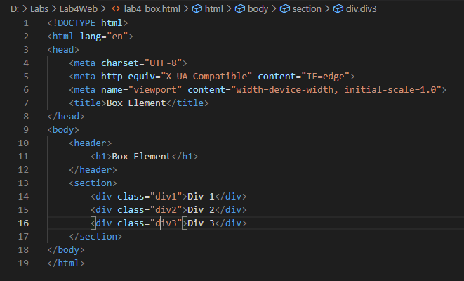
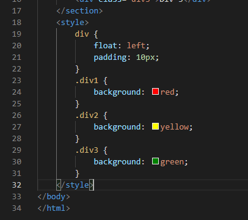
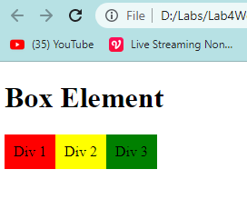
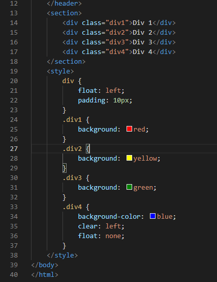
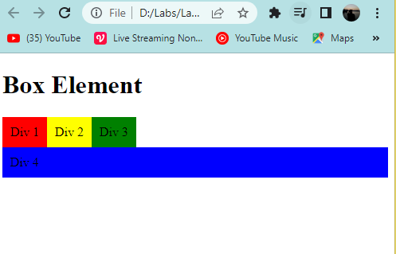
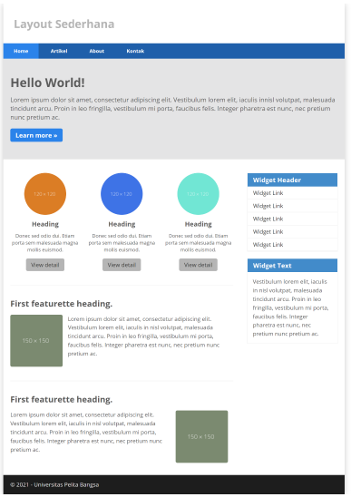

# Lab4Web
Latihan_4 30-3-2022

## Belajar Membuat Box Element
Persiapan membuat dokumen HTML seperti biasa, kemudian tambahkan kode untuk membuat box element dengan tag div, kodingannya sebagai berikut

Kemudian tambahkan deklarasi CSS pada head untuk membuat float element, seperti berikut.

Tampilan website nya seperti ini

### Mengatur Clearfix Element
Clearfix digunakan untuk mengatur element setelah float element. Property clear digunakan untuk mengaturnya.
Tambahkan elemen div4, kemudian atur properti CSS nya seperti berikut

Tampilan website nya seperti ini

## Belajar Membuat Layout Sederhana
Kita akan belajar membuat tampilan website seperti ini

